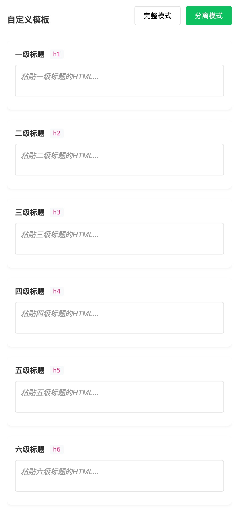

# WX Style Editor

一个小而美的wx公众号排版工具，支持输入Markdown样式，应用多种预设模板，或者输入参考页面（HTML格式）应用自样式。

## 功能特点

- 🎨 内置多种简洁的内置模板
- 📝 支持 Markdown 实时预览
- 💫 所见即所得的样式编辑
- 🎯 支持自粘贴 HTML 样式模板/支持标签级别的 HTML 样式模板
- 🔄 支持样式实时应用
- 📱 响应式设计

## 快速开始

### 安装&运行
```bash
npm install
npm run dev
```


### 使用方法

1. **编写内容**
   - 在左侧编辑器中使用 Markdown 语法编写内容
   - 支持所有常用的 Markdown 语法

2. **选择样式**
   - 使用内置模板：直接点击预设的样式模板
   - 自定义样式：
     - 完整模式：粘贴完整的 HTML 模板
     - 分离模式：为每个 HTML 标签单独设置样式

3. **预览和导出**
   - 实时预览样式效果
   - 一键复制格式化后的内容
  




## 模板定制

### 添加新模板

1. 在 `src/config/templates.js` 中添加新模板配置：
```javascript
export const BUILTIN_TEMPLATES = [
  {
    name: '模板名称',
    description: '模板描述',
    preview: require('@/assets/templates/your-preview.jpg'),
    styles: {
      // 定义各标签样式
      h1: { / 样式配置 / },
      p: { / 样式配置 / },
      // ...
    }
  }
]
```

2. 将预览图片放入 `src/assets/templates/` 目录

### 支持的样式属性

- 字体相关：fontSize, fontWeight, fontFamily, lineHeight, letterSpacing
- 颜色相关：color, backgroundColor
- 边距相关：margin, padding
- 边框相关：border, borderRadius
- 其他：textAlign, textDecoration 等

## 项目结构
src/
├── assets/ # 静态资源
├── components/ # 组件
├── config/ # 配置文件
├── utils/ # 工具函数
├── views/ # 页面
└── App.vue # 根组件


## 主要组件

- **EditorContainer**: 主容器组件，协调编辑器、模板和预览
- **TextEditor**: Markdown 编辑器组件
- **TemplateEditor**: 样式模板编辑器组件
- **PreviewPanel**: 预览面板组件

## 技术栈

- Vue 3
- Markdown-it
- SCSS
- DOMPurify

## 贡献指南

1. Fork 本仓库
2. 创建特性分支：`git checkout -b feature/AmazingFeature`
3. 提交改动：`git commit -m 'Add some AmazingFeature'`
4. 推送分支：`git push origin feature/AmazingFeature`
5. 提交 Pull Request

## 许可证

MIT License

## 作者

赛博95555

